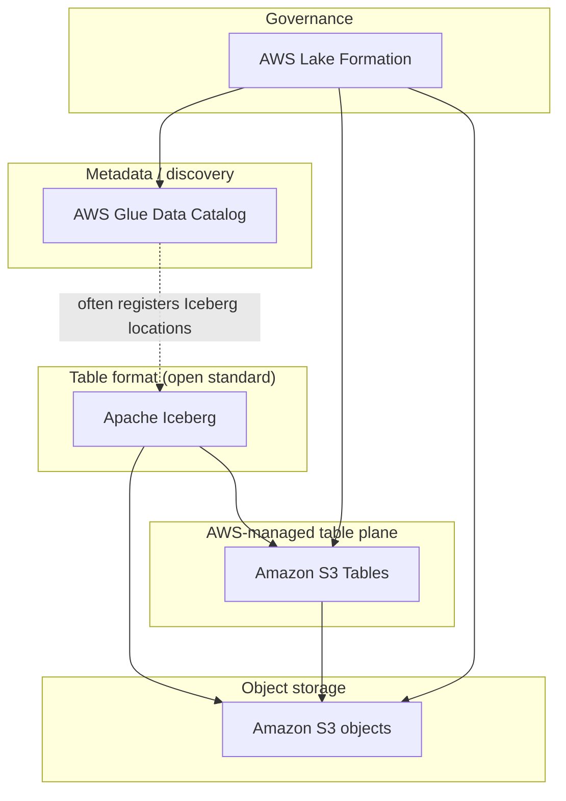

# AWS data lake components

## Background

This package exports Postgres `AuditEvent` data to **Apache Iceberg** tables, either into a normal **S3** bucket or into **Amazon S3 Tables** (managed Iceberg). The sections below clarify how **Iceberg**, **S3**, **AWS Glue**, **S3 Tables**, and **AWS Lake Formation** relate so they are easier to tell apart.

### Apache Iceberg

**Iceberg** is an open table format, not an AWS product. It defines how data files (often Parquet), manifests, snapshots, and schema evolution are laid out and committed. Query engines (DuckDB in this package, Spark, Athena, and others) use Iceberg to read and write **consistent** tables on top of object storage.

In short: **Iceberg is the contract for what a “table” is on top of files.**

### Amazon S3

**S3** is object storage: the durable bytes (Parquet files, Iceberg metadata JSON, etc.). The README’s unmanaged export path (`--s3-bucket`) writes Iceberg-compatible layout into a bucket you control without requiring other AWS data-lake services.

### Amazon S3 Tables

**S3 Tables** is AWS’s **managed** surface for **Iceberg** tables: AWS runs the table bucket, APIs, and integrations so clients target a **table bucket ARN** (for example `arn:aws:s3tables:us-east-1:123456789012:bucket/my-bucket`) instead of you wiring every catalog detail yourself. Storage is still ultimately on S3; the difference is **who owns the table-management and integration story** (you vs AWS).

The README’s S3 Tables path uses `--aws-s3-table-arn` for this mode.

### AWS Glue

**Glue** is a family of services; the name often refers to different layers:

| Piece | Role |
| --- | --- |
| **AWS Glue Data Catalog** | A Hive-compatible **metastore**: databases, tables, columns, partitions. Athena, EMR, and Glue jobs often use it so engines know *where* tables are. |
| **Glue ETL / Crawlers** | **Jobs** that move or transform data and **crawlers** that infer schema and register tables in the catalog. |

Iceberg tables **can** be registered in the Glue Data Catalog (a common pattern: Iceberg + S3 + catalog in Glue). They **do not** require Glue ETL; this export tool uses DuckDB, not Glue Spark.

**Glue Data Catalog** is the metadata phone book; **Glue jobs** are optional compute to populate or transform data.

### AWS Lake Formation

**Lake Formation** is a **governance and access-control** layer: it can **register** data lake resources (S3 locations, Glue catalog resources, and integrations such as S3 Tables), manage **permissions** (often finer than raw IAM on prefixes), and work with IAM and LF-tags.

You may register **S3 Tables** with Lake Formation so central policies apply to those table buckets alongside classic S3 prefixes.

### How they fit together

### Quick reference

| Question | Answer |
| --- | --- |
| Is Iceberg the same as Glue? | **No** — Iceberg is an open format; Glue is AWS (catalog and optional jobs). |
| Do I need Glue to use Iceberg on S3? | **No** — the unmanaged bucket export path does not depend on Glue. |
| Is S3 Tables the same as “tables in S3”? | **Not exactly** — S3 Tables is a **specific AWS product** for managed Iceberg with `s3tables` ARNs, as opposed to a generic bucket you manage end to end. |
| Where does Lake Formation sit? | **Above** storage and table resources: **registration and access control**, including S3 Tables when registered. |

## Redshift, Athena, and Redshift Spectrum

The sections above focus on **lake** components (S3, Iceberg, Glue, Lake Formation). AWS also has multiple ways to run **SQL** over analytics data, which is easy to confuse. Here is a concise map and a bit of **how these product lines got here**.

### What each thing is

- **Amazon Redshift** is a **managed data warehouse**: you load (or stream) data into Redshift, and you run **SQL** over data **stored in the warehouse** (columnar, MPP). It is the “classic” **warehouse in AWS**.
- **Amazon Athena** is a **serverless query service** you use to run **SQL** over data in **S3** using table definitions in a **metastore** (often **AWS Glue**). It does not store your primary table data in a Redshift cluster; it **reads S3** when you query.
- **Redshift Spectrum** is **not a separate database product**. It is a **Redshift feature**: the same Redshift SQL can define **external** tables that read **S3** (with metadata in **Glue**), and **join** that to data **in** Redshift.

### Practical differences

| | **Redshift** | **Athena** | **Spectrum (on Redshift)** |
| --- | --- | --- | --- |
| **Data location** | In-cluster storage (and related features) | S3 (via catalog) | S3 **and** in-cluster (hybrid) |
| **Operations** | You size and run a **cluster** (or use **Redshift Serverless**—still the same product) | **No** cluster; **serverless** | You already run **Redshift**; Spectrum adds S3 as external tables |
| **Typical use** | Curated marts, BI, predictable ELT | **Ad-hoc** / data-lake / irregular SQL on **files** | **Join** warehouse data to **lake** data without loading all of S3 into Redshift |

**Overlap** is real: S3 and often **Glue** are shared ideas. **Athena** and **Spectrum** both can “SQL over S3” with Glue metadata; **Redshift** without Spectrum is “SQL over what you have **loaded** into the warehouse” unless you use another path to bridge the lake.

**JDBC:** You connect a SQL client to **Redshift** with the **Redshift JDBC** driver, and to **Athena** with the **Athena JDBC** driver. There is no generic “JDBC to S3”; you connect to a **query engine** (Athena) or a **warehouse** (Redshift that may use Spectrum for externals).

### How these lines came to be (light history)

Rough timeline of **ideas** in AWS (exact GA months vary; check AWS release posts for your year):

1. **S3** became the default durable, cheap place to land **exports, logs, and big files**. That does not provide SQL, so the ecosystem was **EMR** (Hadoop/Spark) and, later, “just give me SQL on the bucket.”
2. **Redshift (announced 2012)** was AWS’s early answer for a **true cloud data warehouse**: managed, scale-out, columnar MPP. The engine traces to **licensed** technology in the **ParAccel** line—often mis-described as an **acquisition** by Amazon. The important bit for mental models is: **licensed/heritage MPP engine**, not “a random fork of Presto.”
3. **EMR and Presto/Trino (open source)** made **ad-hoc SQL** over big storage normal. **Athena (2016)** gave a **fully managed, serverless** “SQL on S3” without running your own cluster, using a **Presto-class** **query engine** (Presto is an **open-source** project, historically from Meta; AWS productized a familiar **engine pattern** for S3 + Glue, not a unique acquisition you must remember).
4. **Redshift** shops still kept **BI and modeled** data in Redshift, while new **raw** and **huge** data sat in **S3**. ETL into Redshift for everything was slow and expensive. **Spectrum (mid-2010s)** added **S3 external tables inside Redshift**: one SQL dialect could **join** in-cluster and **S3** data, often with **Glue**-compatible metadata. That **intentionally** overlaps the *idea* of Athena (both can use Glue and S3) from a **Redshift-first** place.
5. **Glue**, **Lake Formation**, and modern **lakehouse** patterns normalized **one catalog (often Glue)**—which both **Spectrum** and **Athena** can use, which is why the products can feel **duplicated** even though the **centers of gravity** differ: **warehouse-centric** vs **query-on-S3–centric**.

### How to disambiguate quickly

- The **source of truth** is **S3 + Glue** and you want **low operations** and **pay-per-query** on files → start with **Athena**.
- The **source of truth** is **loaded, modeled** data in a **warehouse** for BI → **Redshift** first.
- You **already** use Redshift and need to **read or join S3** without ETLing all of it into the cluster → **Redshift Spectrum** (a **mode of Redshift**, not a second product line in the same sense as Athena).
